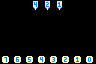

# Binary Decoder

Input: three pins representing the values 1, 2, and 4.

Output: seven lights representing the values 0 through 7.

Task: Light up the pin that shows the sum of the activated input values.  For example, if input pins 1 and 4 are active, then output light 5 (and _only_ that output) should be lit up.

### Discussion

The three inputs represent a three-digit binary number, where "on" (active) means 1 and "off" (dark) means 0.  The rightmost pin represents the 1's place; the middle pin is the 2's place; and the leftmost pin is the 4's place.  Adding up those values, for the pins that are on, gives you the value of the number.

Binary numbers are used all over the place in digital logic, because they are a very compact way to represent numbers.  In this example, you can represent 8 different values using only 3 lines instead of 8.  The savings grows as you add more lines; 4 lines can represent 16 numbers (0-15), and 8 lines could represent 256 values (0-255).
